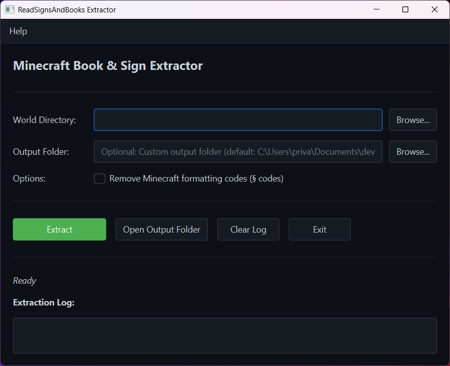
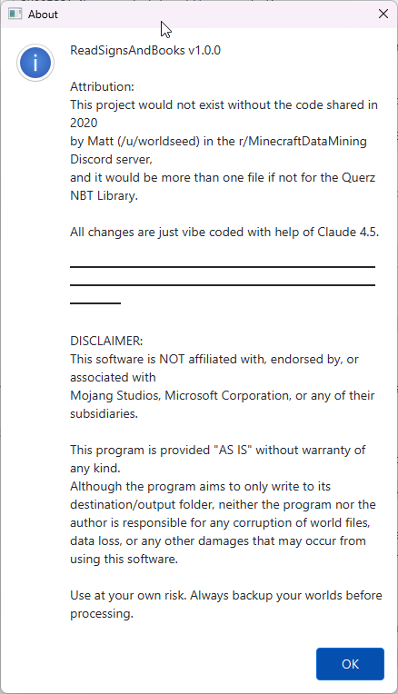

= Vibed-ReadSignsAndBooks.jar

image:./src/main/resources/icons/icon.svg[ReadSignsAndBooks Icon,150,150,float="right"]

Full attribution go to the source code shared on 2020 by `Matt (/u/worldseed)` in the `r/MinecraftDataMining` 's Discord server.
Additional Attributions go to https://github.com/TheWilley/Text2Book and https://github.com/ADP424/MinecraftBookConverter.

All changes are just vibe coded with help of Claude 4.5.

== Download

link:https://github.com/JonasPammer/Vibed-ReadSignsAndBooks.jar/releases/latest/download/ReadSignsAndBooks.jar[*Download Latest ReadSignsAndBooks.jar*]

== Features

This tool scans Minecraft world files and extracts:

* *Written books* (with title and author)
* *Writable books* (book and quill)
* *Signs* with text (all variants: regular, hanging, wall signs)
* *Books in containers:* chests, barrels, shulker boxes, bundles, item frames, minecarts, boats, and more
* *Books in containers of containers* (e.g., inside bundles in frames, inside shulker boxes in chests)
* *Books in player inventories* and ender chests
* *Duplicate tracking:* Saves duplicate books to `.duplicates/` folder instead of skipping them

== Usage

. link:https://github.com/JonasPammer/Vibed-ReadSignsAndBooks.jar/releases/latest/download/ReadSignsAndBooks.jar[*Download ReadSignsAndBooks.jar*]

=== Quick Start (The Easiest Way)

Double Click or run without arguments to open the GUI Wrapper.

=== Quick Start (The Easy Way)

. *Find your Minecraft world folder:*
+
* Windows: `%appdata%\.minecraft\saves\YourWorldName`
* Mac: `~/Library/Application Support/minecraft/saves/YourWorldName`
* Linux: `~/.minecraft/saves/YourWorldName`

. *Run the tool:*
+
[source,bash]
----
java -jar ReadSignsAndBooks.jar --world "C:\Users\YourName\AppData\Roaming\.minecraft\saves\YourWorldName"
----
+
Or simply drag and drop your world folder into the same directory as the JAR and run it.

. *Find your results* in the newly created `ReadBooks/` folder!

=== What You'll Get

The tool creates output in `ReadBooks/YYYY-MM-DD/`:

* `books/` - directory containing individual Stendhal format files for each unique book
** Each book is saved as: `Title_(PageCount)_by_Author~location~coords.stendhal`
** Example: `My_Book_(3)_by_Joe~minecraft_chest~-10_65_20.stendhal`
** Stendhal format preserves Minecraft formatting codes (§ codes)
* `books/.duplicates/` - directory containing duplicate books (same content, different locations)
* `all_signs.txt` - all signs found in the world, one per line
** Example: `Chunk [31, 31]	(-2 75 -5)		Line 1! ⚠ Line 2! ☀`
* `all_books.txt` - all books in Stendhal format, separated by `#region` and `#endregion` markers for VSCode folding
* `all_books.csv` - CSV export of all books with metadata
* `all_signs.csv` - CSV export of all signs with metadata
* *Ready-to-use Minecraft Datapacks* (4 versions with version-specific commands):
** `readbooks_datapack_1_13/` - Minecraft 1.13-1.14.3 (pack_format 4)
*** Uses `functions/` directory (plural) and 1.13 command syntax
** `readbooks_datapack_1_14/` - Minecraft 1.14.4 (pack_format 4)
*** Uses `functions/` directory (plural) and 1.14 command syntax
** `readbooks_datapack_1_20_5/` - Minecraft 1.20.5-1.20.6 (pack_format 41)
*** Uses `functions/` directory (plural) and component-based syntax
** `readbooks_datapack_1_21/` - Minecraft 1.21+ (pack_format 48)
*** Uses `function/` directory (SINGULAR - changed in 1.21!) and updated syntax
** Each datapack contains:
*** `pack.mcmeta` - Datapack metadata with appropriate pack_format number
*** `data/readbooks/functions/books.mcfunction` OR `data/readbooks/function/books.mcfunction` - Book recreation commands
*** `data/readbooks/functions/signs.mcfunction` OR `data/readbooks/function/signs.mcfunction` - Sign placement commands
*** Directory structure varies: Pre-1.21 uses `functions/` (plural), 1.21+ uses `function/` (singular)
* `logs.txt` - program debug logs
* `summary.txt`
** Breakdown by container type (chests, shulker boxes, villagers, etc.)
** Breakdown by location type (block entities, entities, players)
** Processing time and performance metrics

=== Using the Datapacks in Minecraft

The generated datapacks can be directly copied into your Minecraft world:

. *Locate your world's datapacks folder:*
+
* Windows: `%appdata%\.minecraft\saves\YourWorldName\datapacks\`
* Mac: `~/Library/Application Support/minecraft/saves/YourWorldName/datapacks/`
* Linux: `~/.minecraft/saves/YourWorldName/datapacks/`

. *Copy the appropriate datapack folder* for your Minecraft version:
+
[source,bash]
----
# Example: For Minecraft 1.21+
cp -r ReadBooks/YYYY-MM-DD/readbooks_datapack_1_21 ~/.minecraft/saves/YourWorldName/datapacks/
----

. *In Minecraft, reload datapacks:*
+
[source,mcfunction]
----
/reload
----
+
You should see a message confirming the datapack was loaded.

. *Run the function to get all books:*
+
[source,mcfunction]
----
/function readbooks:books
----
+
This will give you all extracted books.

. *Run the function to place all signs:*
+
[source,mcfunction]
----
/function readbooks:signs
----
+
This will place all signs starting at your current position.

TIP: Choose the datapack version that matches your Minecraft version for best compatibility!

== Development

[source,cmd]
----
gradle build
----

Run directly with Gradle:

[source,bash]
----
gradle run --args="--world /path/to/world"
----

To use custom JVM arguments for large worlds:

[source,bash]
----
gradle run "-Dorg.gradle.jvmargs=-Xmx10G -XX:+UseG1GC -XX:MaxGCPauseMillis=200" --args="--world /path/to/world"
----

=== Testing

The integration test uses real minecraft world(s).

[source,bash]
----
gradle test
----

Afterwards, you can look at the generated files in the `build/test-worlds/*/ReadBooks/` folder, e.g. link:./build/test-worlds/1_21_10-44-3/ReadBooks/[]